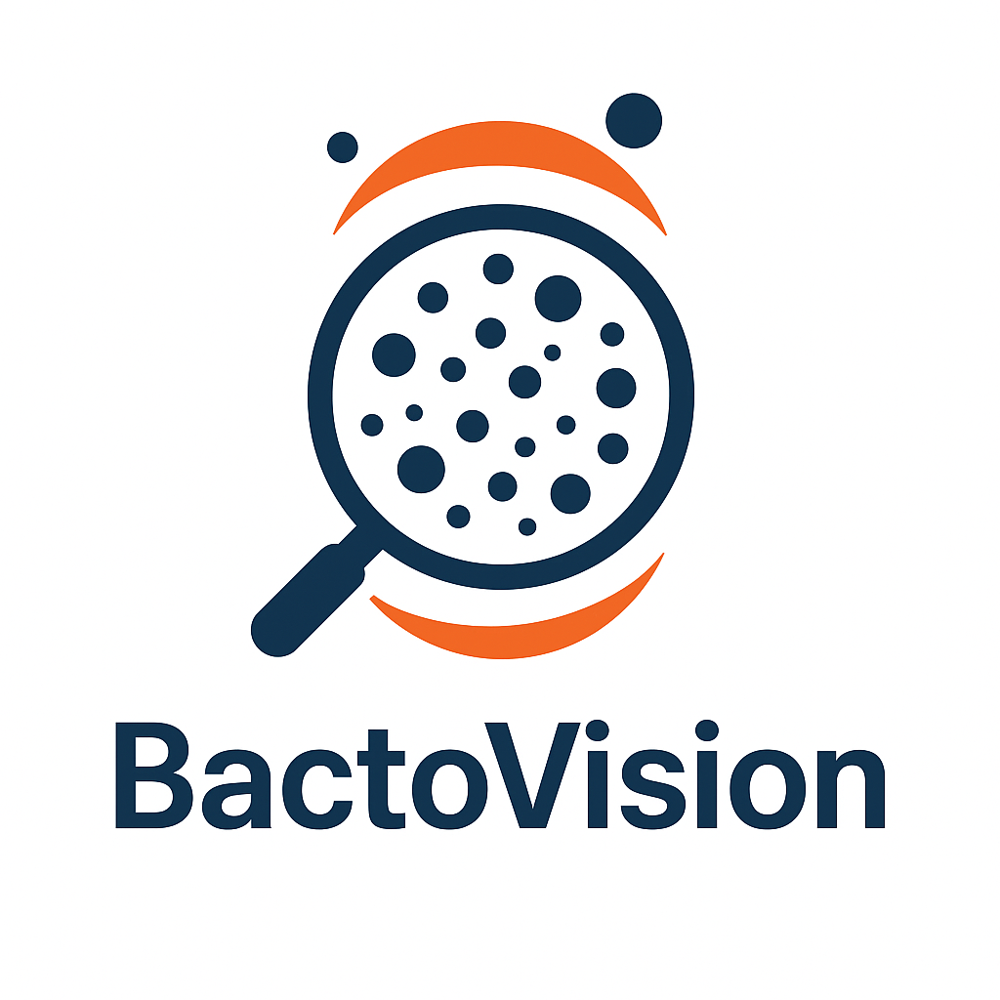

# BactoVision

{ align=right width=300 }

## A Jupyter widget for annotating and visualizing bacterial growth data

BactoVision provides a powerful interactive widget for Jupyter notebook designed for fast semi-automated annotation of bacterial growth images. It combines intuitive manual drawing tools with automatic detection algorithms to make the annotation process efficient and accurate.

BactoVision is used in the paper:

_Tyrosine auxotrophy shapes Staphylococcus aureus nasal colonization and interactions with commensal communities_ L. Camus et al. 2025 (submitted)

## Key Features

- **Interactive annotation** - Combine automatic and manual annotation methods
- **Grid system** - Analyze data in a structured grid format
- **Image enhancement** - Apply CLAHE and other image processing techniques
- **Quantitative analysis** - Extract metrics on bacterial growth
- **Intuitive interface** - Simple and user-friendly design

## Quick Start

```python
from bactovision.widget import BactoWidget

# Create a widget with an image
widget = BactoWidget('path/to/image.png')

# Display the widget
widget
```

## Citation

If you use BactoVision in your research, please cite:

```
Camus L. et al. (2025). Tyrosine auxotrophy shapes Staphylococcus aureus nasal colonization 
and interactions with commensal communities. [Journal pending].
```
