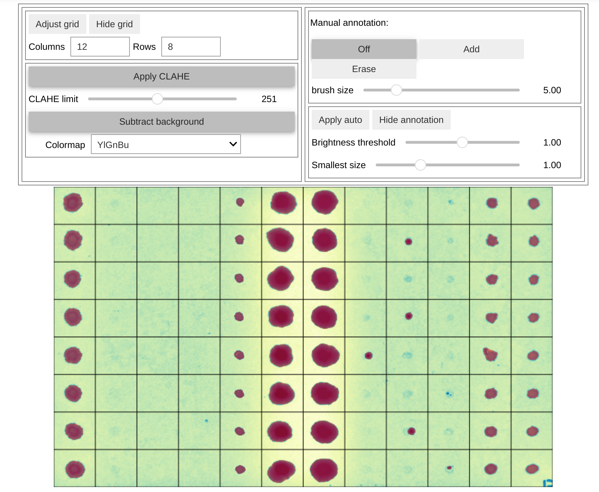
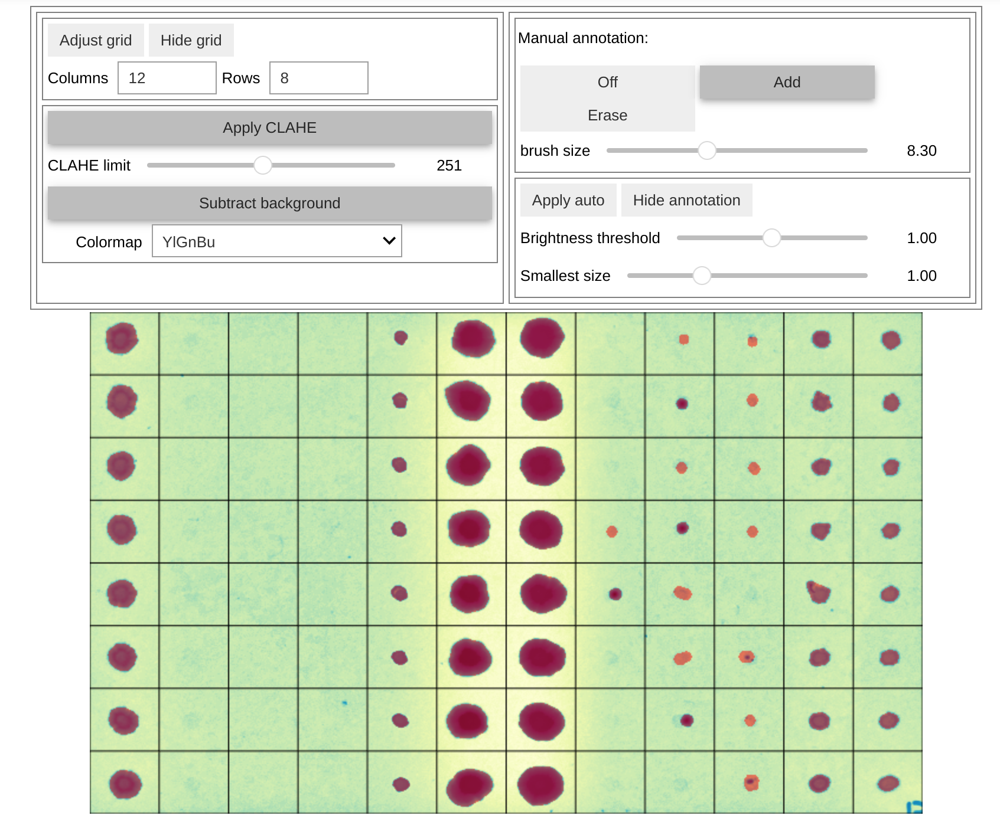

# Annotations

This guide covers the annotation capabilities in BactoVision, which allow you to mark bacterial colonies within your images.

### Fine-Tuning Image Before Annotation

For better annotation results, consider adjusting the image preprocessing integrated into the widget first:

1. Enable Contrast Limited Adaptive Histogram Equalization (CLAHE) to enhance contrast
2. Use background subtraction to remove uneven illumination
3. Experiment with different colormaps for better visibility

{align=center width=700}

Note that the preprocessing can help with the automatic annotation. However, it is not used for calculating the final metrics - only for the segmentation/annotation process.

## Annotation Methods

BactoVision offers two complementary annotation approaches:

1. **Automatic annotation** - Algorithm-based detection of bacterial colonies
2. **Manual annotation** - Direct drawing tools for fine-grained control

These approaches can be used individually or in combination to achieve the best results.

## Automatic Annotation

The automatic annotation feature uses thresholding techniques to identify bacterial colonies in your images.

### How It Works

The automatic annotation system works through the following steps:

1. Applies Otsu thresholding with a customizable threshold multiplier
2. Removes small objects below a specified size
3. Clears border objects
4. Creates convex hulls around the identified regions

### Configuring Automatic Annotation

You can adjust two key parameters to optimize automatic detection:

#### Brightness Threshold

The "Brightness threshold" slider controls the sensitivity of detection:

- **Higher values** (>1.0) - More restrictive detection, only selects very bright colonies
- **Lower values** (<1.0) - More inclusive detection, may include background noise

#### Smallest Size

The "Smallest size" slider determines the minimum size of colonies to be detected:

- **Higher values** - Ignores smaller colonies
- **Lower values** - Includes smaller colonies, but may include noise

### Running Automatic Annotation

To apply automatic annotation:

1. Adjust the threshold and size parameters
2. Click the "Apply auto" button
3. Repeat if needed

{align=center width=700}

## Manual Annotation

Manual annotation allows you to directly draw or erase annotations for precise control.

### Annotation Modes

The manual annotation system offers three modes:

- **Off** - Disables manual annotation
- **Add** - Enables drawing annotations
- **Erase** - Enables erasing annotations

The brush size can be adjusted using the corresponding slider.

{align=center width=700}


## Combined Approach

For best results, consider using a combined approach:

1. Start with automatic annotation to quickly identify most colonies
2. Switch to manual annotation to:
   - Add missed colonies
   - Remove false positives
   - Refine boundaries

Note that automatic annotation applied at any stage will erase manual annotation.

## Viewing and Hiding Annotations

You can toggle the visibility of annotations using the "Hide annotation" button. This is useful when you want to check the original image without annotations.

## Extracting Annotation Data

After annotation, you can extract the annotation mask:

```python
# Get binary mask of annotations
mask = widget.get_annotation_mask()

# Analyze annotations per grid cell
metrics = widget.get_metrics()
```
